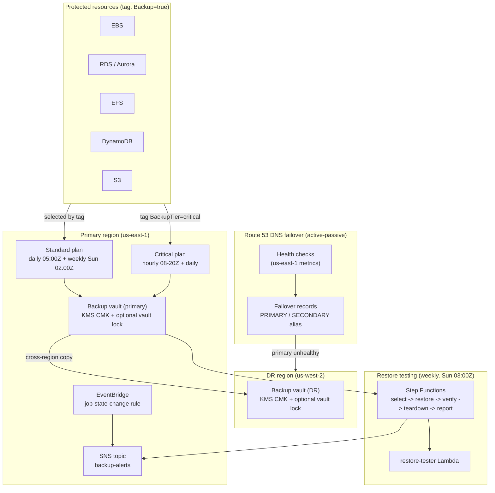

# aws-backup-dr

Cross-region AWS Backup framework with immutable vaults, automated restore testing, and Route 53 DNS failover.

[](https://github.com/shivajichaprana/aws-backup-dr/actions/workflows/backup-ci.yml)


---

## Overview

`aws-backup-dr` is a production-grade, Terraform-managed backup and disaster-recovery
platform built entirely on AWS-native services. It is designed around one premise:
**a backup you have never restored is a hypothesis, not a backup.** Every layer of the
stack — encryption, immutability, cross-region replication, and continuous restore
testing — exists to make recovery a routine, verified operation rather than a
crisis-time gamble.

What it provisions:

- **Immutable backup vaults** — KMS-encrypted vaults with optional compliance-mode
  vault lock that prevents recovery-point deletion before retention expiry, even by
  the account root. This is the primary defence against ransomware and malicious
  insiders.
- **Tiered, tag-based backup plans** — a *standard* tier (daily + weekly) and a
  *critical* tier (hourly during business hours + daily), both with automatic
  cross-region copy to the DR region. Resources opt in purely by tag.
- **Automated weekly restore testing** — a Step Functions workflow that selects a
  recent recovery point, restores it, verifies integrity, tears it down, and reports
  the result. Failures page the on-call team.
- **IAM hardening** — a permission boundary that blocks vault/plan/recovery-point
  deletion, a scoped backup-admin role, and an MFA-gated break-glass role.
- **Route 53 DNS failover** — active-passive failover routing with multi-region
  health checks and CloudWatch alarms so a primary-region outage swings traffic to
  DR automatically.
- **Observability** — EventBridge + CloudWatch alarms for backup-job failures,
  missed backup windows, and failed restore tests; a weekly backup-status report
  delivered via SNS.

---

## Architecture



The full component map and design rationale live in
[`docs/architecture.md`](docs/architecture.md); the recovery strategy and tiering
model in [`docs/dr-strategy.md`](docs/dr-strategy.md).

---

## RPO / RTO targets

Recovery Point Objective (RPO) is how much data you can afford to lose; Recovery Time
Objective (RTO) is how long you can afford to be down. The defaults below map directly
to the backup tiers and the failover model shipped in this repo.

| Tier         | Backup cadence (primary)        | RPO        | Restore RTO | DR copy retention |
|--------------|---------------------------------|------------|-------------|-------------------|
| **Critical** | Hourly 08:00–20:00Z + daily     | **≤ 1 hr** | **≤ 4 hrs** | 30 days           |
| **Standard** | Daily 05:00Z + weekly (Sun)     | **≤ 24 hr**| **≤ 8 hrs** | 90 days           |

| DNS failover | Target |
|--------------|--------|
| Detection (health-check flip) | `failure_threshold × request_interval` — default 3 × 30s = **90s** |
| Time to healthy DR responses (RTO) | **≤ 15 min** (governed by record TTL + DR warm-up) |

> RPO is bounded by the most recent recovery point; RTO by how long a restore or a DNS
> swap plus DR scale-up takes. Both are validated continuously by the restore-testing
> workflow and rehearsed via the runbooks in [`runbooks/`](runbooks/).

---

## Quick start

```bash
# 1. Configure your inputs
cp terraform/terraform.tfvars.example terraform/terraform.tfvars
#    Edit terraform.tfvars: regions, retention, SNS email, and (optionally)
#    the Route 53 failover block.

# 2. Initialize and review the plan
make init
make plan

# 3. Apply
make apply

# 4. Opt a resource into backup by tagging it
./scripts/tag-resources.sh standard arn:aws:ec2:us-east-1:123456789012:volume/vol-0abc123
./scripts/tag-resources.sh critical arn:aws:rds:us-east-1:123456789012:db:payments-prod
```

Vault lock is **disabled by default** (`enable_vault_lock = false`). Turn it on only
after you have validated retention settings in a non-production environment — once the
grace period (`changeable_for_days`, minimum 3 days) elapses, the lock is irreversible.
See [`docs/dr-strategy.md`](docs/dr-strategy.md#vault-lock-rollout) for the safe rollout
procedure.

---

## Module reference

| File | Responsibility |
|------|----------------|
| `terraform/backup-vault.tf` | Primary + DR KMS CMKs, backup vaults, SNS topic, job-failure EventBridge rule |
| `terraform/backup-vault-lock.tf` | Compliance-mode vault lock configuration (gated by `enable_vault_lock`) |
| `terraform/backup-plan.tf` | Standard + critical backup plans, AWS Backup service role, region opt-in |
| `terraform/backup-selection.tf` | Tag-based resource selection + backup-compliance alarms |
| `terraform/iam-restrictions.tf` | Permission boundary, backup-admin role, MFA break-glass role |
| `terraform/cross-account-copy.tf` | Optional copy action into a separate DR-account vault |
| `terraform/restore-tester.tf` | Restore-test Lambda, IAM, DLQ, weekly schedule, failure alarm |
| `terraform/restore-workflow.tf` | Step Functions state machine orchestrating the restore test |
| `terraform/route53-failover.tf` | PRIMARY/SECONDARY failover alias records |
| `terraform/health-checks.tf` | Route 53 health checks + us-east-1 CloudWatch alarms |
| `terraform/reporter.tf` | Weekly backup-status reporter Lambda + schedule |
| `lambda/restore-tester/app.py` | Action-dispatched restore-test worker |
| `lambda/backup-reporter/app.py` | Trailing-window backup-activity summariser |

---

## Directory structure

```
aws-backup-dr/
├── terraform/                 # Infrastructure-as-code (root module)
│   ├── backup-vault.tf        # Vaults, KMS CMKs, SNS, job-failure rule
│   ├── backup-vault-lock.tf   # Compliance-mode vault lock
│   ├── backup-plan.tf         # Standard + critical plans, service role
│   ├── backup-selection.tf    # Tag-based selection + compliance alarms
│   ├── iam-restrictions.tf    # Permission boundary + break-glass role
│   ├── cross-account-copy.tf  # Optional cross-account DR vault copy
│   ├── restore-tester.tf      # Restore-test Lambda + schedule + DLQ
│   ├── restore-workflow.tf    # Step Functions restore-test orchestration
│   ├── route53-failover.tf    # DNS failover records
│   ├── health-checks.tf       # Health checks + alarms (us-east-1)
│   ├── reporter.tf            # Weekly backup reporter
│   ├── variables.tf           # Input variables
│   ├── outputs.tf             # Outputs
│   ├── versions.tf            # Provider config (primary, dr, us-east-1 aliases)
│   └── data.tf                # Account / partition data sources + locals
├── lambda/
│   ├── restore-tester/        # Restore-test worker (Python 3.12, arm64)
│   └── backup-reporter/       # Weekly status reporter
├── tests/                     # pytest suite (moto-mocked) for the Lambdas
├── scripts/                   # tag-resources.sh and helpers
├── runbooks/                  # DR failover + restore-from-backup runbooks
├── docs/                      # Architecture + DR strategy
└── .github/workflows/         # CI: terraform validate, checkov, pytest
```

---

## Prerequisites

- Terraform ≥ 1.5 and the AWS provider ≥ 5.0
- AWS credentials with permissions for AWS Backup, KMS, IAM, Route 53, Lambda,
  Step Functions, SNS, SQS, EventBridge, and CloudWatch
- Python 3.12 (to package the Lambdas and run the test suite)
- A remote state backend (an S3 backend stub is provided, commented, in
  `terraform/versions.tf`)

---

## Operations

- **Recover data from a backup:** [`runbooks/restore-from-backup.md`](runbooks/restore-from-backup.md)
- **Fail over to the DR region:** [`runbooks/dr-failover.md`](runbooks/dr-failover.md)
- **Add a workload to backup:** tag it `Backup=true` (and `BackupTier=critical` for the
  critical tier) — no Terraform change needed.

---

## Contributing

See [`CONTRIBUTING.md`](CONTRIBUTING.md). Open a Discussion in the repo or comment on a
PR for questions; report security issues via a
[GitHub Security Advisory](https://github.com/shivajichaprana/aws-backup-dr/security/advisories/new).

## License

MIT License — see [LICENSE](LICENSE).
