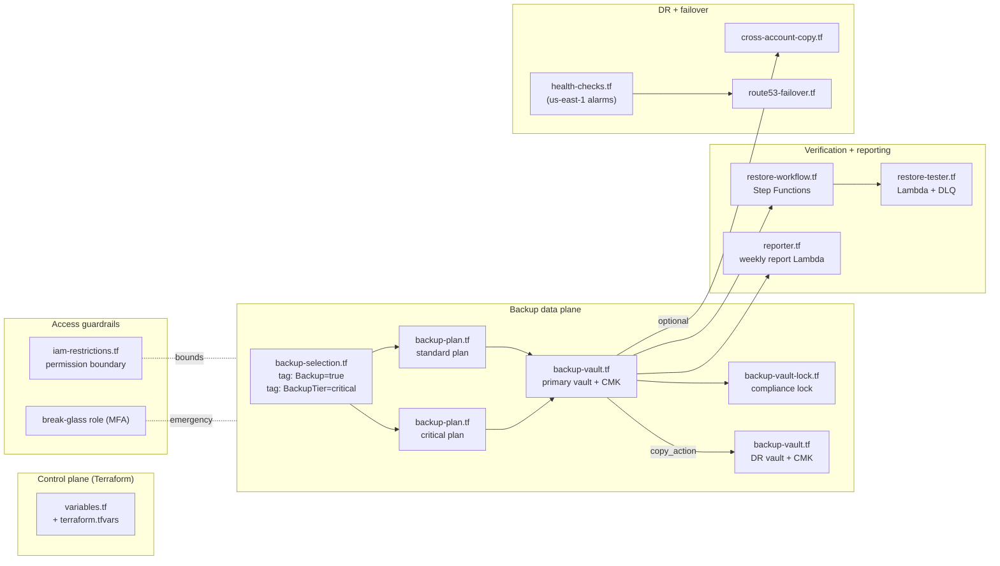

# Architecture — aws-backup-dr

## Overview

This project implements a defence-in-depth backup and disaster-recovery platform on
AWS-native services, following the AWS Backup best-practice framework and the
well-architected reliability pillar. The design separates four concerns that are too
often conflated: **taking** backups, **protecting** them, **proving** they work, and
**recovering** from them.

## Design principles

1. **Immutability first.** Backup vaults support compliance-mode vault lock, which
   gives recovery points WORM (Write Once, Read Many) semantics. Once the grace period
   expires, no principal — including the account root — can delete a recovery point
   before its retention expires. This is the primary defence against ransomware and
   malicious deletion.

2. **Encryption everywhere.** Every recovery point is encrypted with a region-local KMS
   Customer Managed Key (CMK). Key policies scope usage to the AWS Backup service
   principal and the account root only; cross-region copies are re-encrypted under the
   destination region's CMK.

3. **Geographic separation.** Every backup is automatically copied from the primary
   region to a DR region, so a full regional outage never costs you your backups.

4. **Continuous verification.** A weekly Step Functions workflow restores a real
   recovery point, runs integrity checks, and tears the restore down. A backup that
   has never been restored is treated as unverified.

5. **Least privilege + immutability of the control plane.** An IAM permission boundary
   blocks destructive backup operations; a dedicated break-glass role (MFA-gated) is
   the only principal allowed to perform emergency overrides.

6. **Observability by default.** Backup-job failures, missed backup windows, and failed
   restore tests all raise CloudWatch alarms that publish to a single SNS topic; a
   weekly report summarises backup activity independently of the alarms.

## Component map



## Backup tiers

| Tier     | Schedule (UTC)                          | Cold storage | Primary retention | DR retention |
|----------|-----------------------------------------|--------------|-------------------|--------------|
| Standard | Daily `cron(0 5 * * ? *)` + Weekly Sun `cron(0 2 ? * SUN *)` | after 90d | 365d (daily) / 365d (weekly) | 90d / 180d |
| Critical | Hourly `cron(0 8-20 * * ? *)` + Daily   | after 90d    | 365d              | 30d (hourly) / 90d (daily) |

A resource joins the standard tier with `Backup=true`; adding `BackupTier=critical`
moves it to the critical tier. Resource selection is purely tag-driven
(`backup-selection.tf`), so onboarding a workload requires no Terraform change.

The opted-in resource types (`aws_backup_region_settings`) are Aurora, DocumentDB,
DynamoDB, EBS, EC2, EFS, FSx, Neptune, RDS, Redshift, and S3.

## Vault lock (compliance mode)

AWS Backup vault lock in compliance mode enforces WORM semantics:

- After the grace period (`changeable_for_days`, AWS minimum 3 days) expires, the lock
  settings **cannot be modified or removed** — not even by the root account.
- Recovery points cannot be deleted before `vault_lock_min_retention_days` elapses.
- Recovery points are automatically deleted once `vault_lock_max_retention_days` is
  reached.

The lock is gated behind `enable_vault_lock` (default `false`) precisely because it is
irreversible. See [`dr-strategy.md`](dr-strategy.md#vault-lock-rollout) for the
validate-then-lock rollout.

## Encryption architecture

```
Backup job
   │
   ├── Primary region ──▶ KMS CMK (alias/backup-dr-production-backup-primary)
   │                        └── automatic annual key rotation
   │
   └── Cross-region copy ─▶ KMS CMK (alias/backup-dr-production-backup-dr)
                             └── re-encrypts under the DR-region key
```

Each CMK is single-region (`multi_region = false`) and confined to its region. The key
policy grants the AWS Backup service principal only the encrypt/decrypt/grant actions it
needs, conditioned on `kms:CallerAccount`.

## IAM design

`backup-plan.tf` provisions a single AWS Backup service role
(`<prefix>-backup-role`) carrying the AWS-managed `...ForBackup` and `...ForRestores`
policies plus inline grants for S3 backup and cross-region KMS.

`iam-restrictions.tf` adds three guardrails:

| Principal | Purpose |
|-----------|---------|
| Permission boundary (`<prefix>-backup-admin-boundary`) | Denies `DeleteBackupVault`, `DeleteBackupPlan`, `DeleteBackupVaultLockConfiguration`, `DeleteRecoveryPoint`, and unauthenticated `StopBackupJob` regardless of identity policy |
| Backup-admin role | Routine backup management, with the boundary attached — cannot destroy vault data |
| Break-glass role | The only principal excluded from the destructive-operation deny; dormant, MFA-gated, time-boxed |

## Restore-testing workflow

`restore-workflow.tf` defines a STANDARD Step Functions state machine that runs every
Sunday at 03:00 UTC. It is action-dispatched: each state invokes the
`restore-tester` Lambda with an `action` (`select → restore → status → verify →
teardown → report`). Key reliability properties:

- **Mandatory teardown.** Every failure path funnels through `TeardownOnFailure` so a
  restored resource is never leaked (cost + blast radius).
- **Bounded polling.** `CheckRestoreStatus` loops with a 60s wait and aborts after 60
  polls to avoid runaway executions.
- **Always reports.** Both success and failure paths emit a `report` action; failures
  publish the `RestoreTestFailure` CloudWatch metric that the
  `<prefix>-restore-tester-failure` alarm watches.
- **Cross-account capable.** When `restore_test_role_arn` is set, all data-plane calls
  run in an isolated sandbox account.

## DNS failover

`route53-failover.tf` + `health-checks.tf` provide active-passive failover. PRIMARY and
SECONDARY alias records share a name; Route 53 answers with PRIMARY while its health
check is healthy and swings to SECONDARY (DR region) automatically when it is not.

A region-pinning subtlety is handled explicitly: **Route 53 health-check metrics are
published only in us-east-1**, regardless of where the application runs. All
health-check alarms and the alarm SNS topic therefore use the `aws.us_east_1` provider
alias, so the stack works correctly even when `primary_region` is not us-east-1.

The entire failover stack is gated behind `enable_dns_failover`, with a `check{}` block
that fails at plan time if the feature is enabled without its required inputs.

## Monitoring

| Alarm / signal | Trigger | Action |
|----------------|---------|--------|
| `<prefix>-backup-job-failures` | ≥ 1 failed backup job in 24h | SNS |
| `<prefix>-no-backup-completions` | 0 completed backup jobs in 24h (`treat_missing_data = breaching`) | SNS |
| EventBridge job-state rule | Backup job `FAILED`/`ABORTED`/`EXPIRED` | SNS |
| `<prefix>-restore-tester-failure` | A weekly restore test failed | SNS |
| `<prefix>-primary-endpoint-unhealthy` | Primary health check Unhealthy | SNS (us-east-1) |
| Weekly reporter | Scheduled Mon 08:00Z | SNS summary + `BackupDR/Reporting` metrics |

## Adding a new service

1. Tag the resource: `Backup=true` for standard, plus `BackupTier=critical` for the
   critical tier. Use `scripts/tag-resources.sh`.
2. Wait for the next backup window — no Terraform change required.
3. Confirm in AWS Backup console → Protected resources, or wait for the next weekly
   report.
